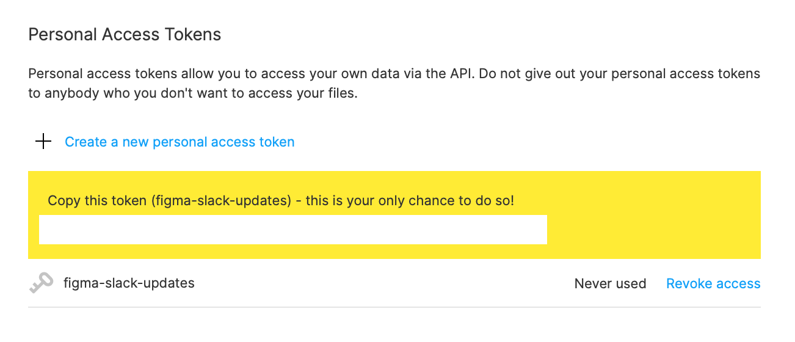
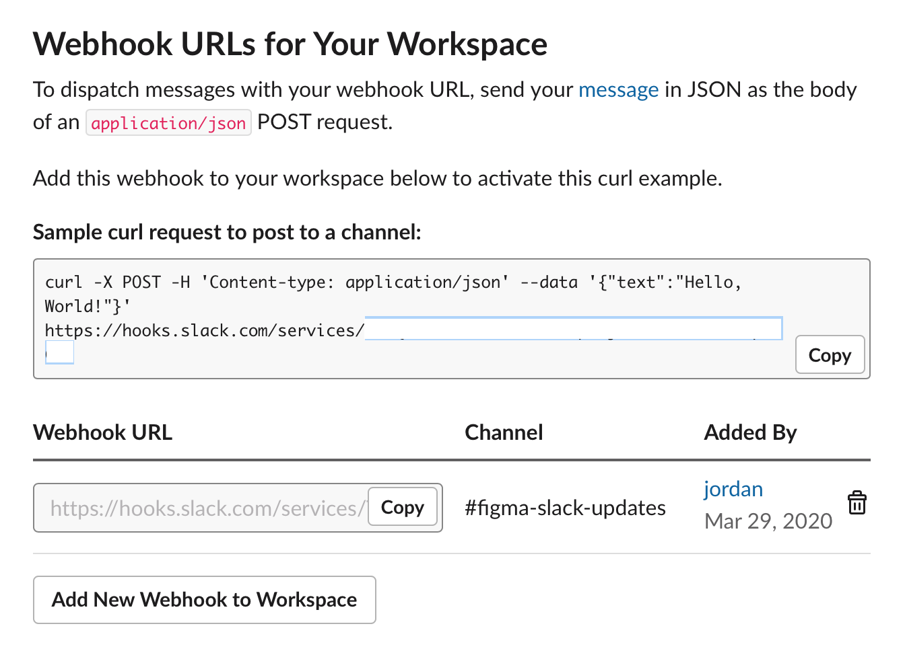
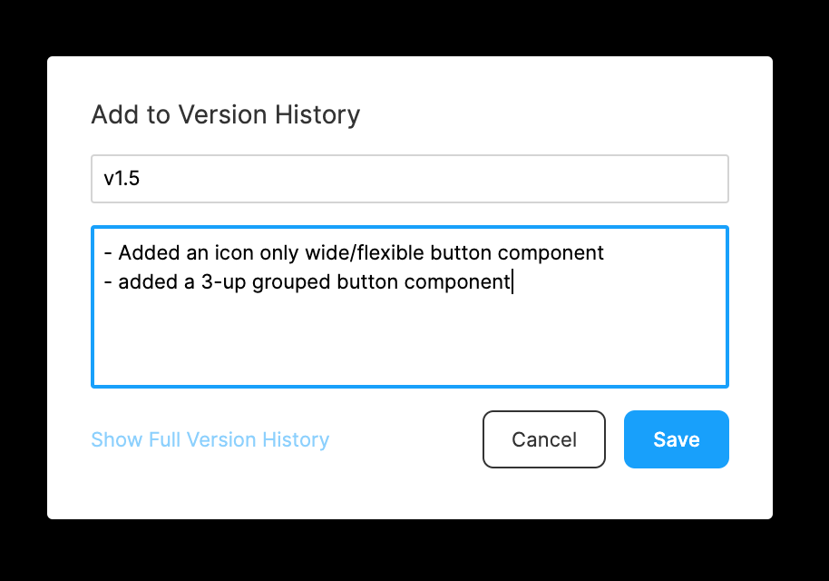
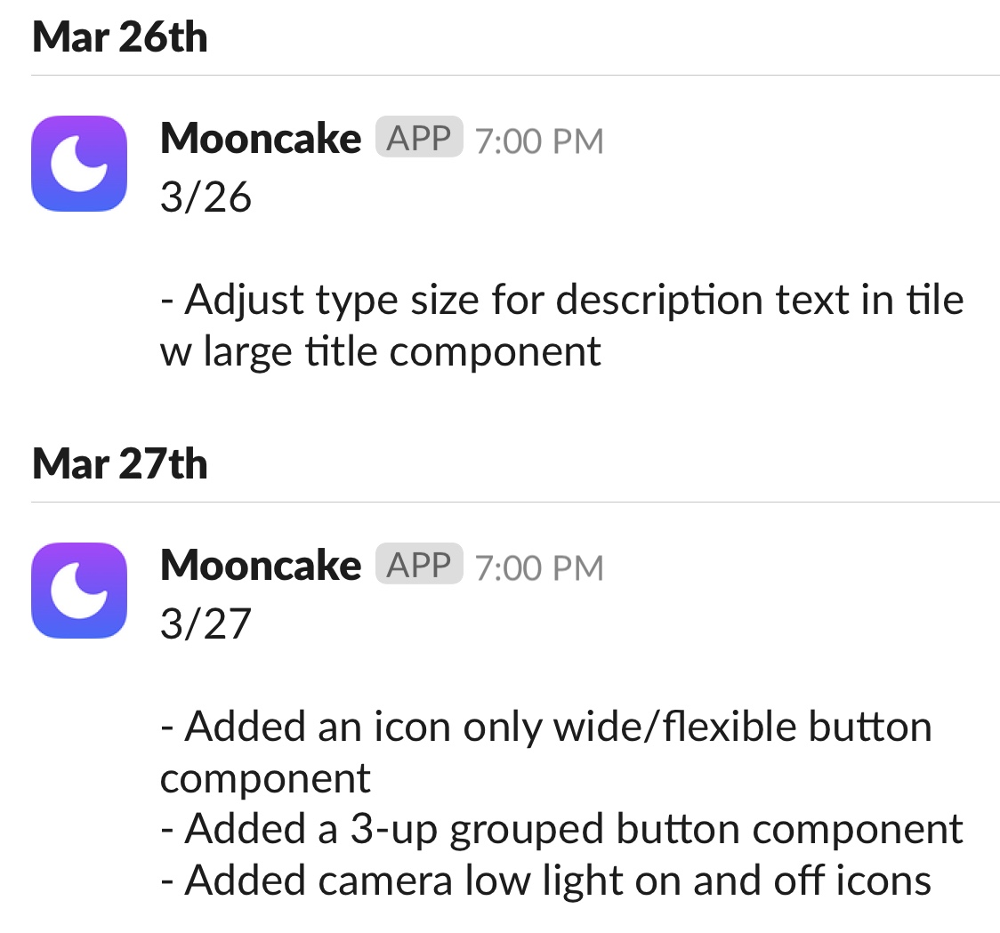

# Figma Slack updates
Automatically post updates to a Slack channel each day with the updates from a Figma file's version history. [View example](https://twitter.com/jsngr/status/1208161921687576577)

- [Setting up](#setting-up)
  - [Heroku](#heroku)
      - [Deploying the Heroku app](#deploying-the-heroku-app)
      - [Setting up your Heroku app](#setting-up-your-heroku-app)
      - [Customizing your job](#customizing-your-job)
      - [Testing that it worked](#testing-that-it-worked)
  - [Figma](#figma)
      - [Get a Personal Access Token](#get-a-personal-access-token)
      - [Get your file key](#get-your-file-key)
  - [Slack](#slack)
      - [Create a new Slack app](#create-a-new-slack-app)
      - [Activate Incoming Webhooks](#activate-incoming-webhooks)
- [Figma Version History](#figma-version-history)
    - [Publishing changes](#publishing-changes)
    - [Slack updates](#slack-updates)

## Setting up

### Heroku
#### Deploying the Heroku app
1. Click the Deploy to Heroku button

2. Give your Heroku app a name
3. For the **Config Vars** section, proceed to the [Figma](#figma) and [Slack](#slack) sections of the README in order to obtain your `FIGMA_FILE_KEY`, `FIGMA_PERSONAL_ACCESS_TOKEN`, `SLACK_CHANNEL_ID`, `SLACK_TEAM_ID`, `SLACK_USER_ID`
3. Click "Deploy app"

#### Setting up your Heroku app
1. After the deploy is successful, click on "Manage App"
2. Click on "Heroku Scheduler" in the **Installed add-ons** section
3. Click on "Create job"
4. [Customize your job](#customizing-your-job)

#### Customizing your job
1. In the **Schedule** section, set the interval to "Every day at..." and choose a time (in UTC) that works best for you
2. In the **Run Command** section, set the command to `python update.py`
3. Click on "Save Job"

#### Testing that it worked
First, in the Figma file that you grabbed the file key for earlier, [make some changes and create a version](#figma-version-history).

1. In the dashboard for the app that you created in Heroku, click on "More" in the top right corner, and then "Run console"
2. Enter `python update.py` and click "Run"
3. Your changes should be posted to Slack 🎉

Now that you're all set up, your Slack channel will receive updates every day at the time you've selected your Heroku Scheduler job to run (assuming changes were made in Figma).

### Figma
#### Get a Personal Access Token
1. While logged into Figma on the web or the desktop app, visit your [Account Settings](https://www.figma.com/settings)
2. Under **Personal Access Tokens**, click "Create a new personal access token"
3. Name the the access token whatever you'd like, for example: `figma-slack-updates`
3. Copy the token - this is your only chance to do so! This is your `FIGMA_PERSONAL_ACCESS_TOKEN`

#### Get your file key
Visit the Figma file that you'd like to post updates for and copy its `file key`. The file key can be found when you copy the file's link or visit the file on the web: figma.com/file/`file key`/... This is your `FIGMA_FILE_KEY`

### Slack
#### Create a new Slack app
1. While logged into Slack on the web, visit [Your Apps](https://api.slack.com/apps)
2. Click on "Create New App". Give it a name and a team to post in.

#### Activate Incoming Webhooks
1. After the app is created, visit **Incoming Webhooks**
2. Turn the **Activate Incoming Webhooks** toggle on
3. Under **Webhook URLs for Your Workspace**, click "Add New Webhook to Workspace"
4. Choose a channel for the Slack app to post updates to
5. Under **Webhook URLs for Your Workspace**, take note of the code inside of "Sample curl request to post to a channel". There are three pieces of info to copy from the URL: the team ID, user ID, and channel ID. hooks.slack.com/services/`team id`/`user id`/`channel id`. These are your `SLACK_TEAM_ID`, `SLACK_USER_ID`, and `SLACK_CHANNEL_ID`

## Figma Version History

### Publishing changes
In the Figma file that you set up to post changes from, you can either publish your component changes or create a new version in your file's version history. Both of these kinds of changes will be posted to Slack.
###### Note: The "Description" field for each of these is required in order for it to be posted to Slack. If there is no description provided, the changes won't be mentioned in Slack.

### Slack updates
Slack posts will happen every day at the time you've selected your Heroku Scheduler job to run (assuming changes were made in Figma). They'll appear with the date of the changes, followed by a list of all of your changes for that given day. 
###### It's recommended that your descriptions for changes are prefixed with a "-" and followed by a newline.

